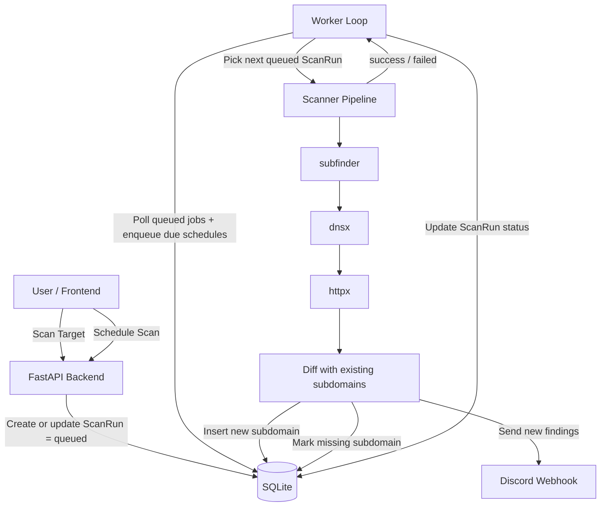

# SubMon

> Some say bug bounty isn't just about finding bugs, but being the "first" to find them. I'm building this tool to notify hunters when new subdomains appear.

## What Can It Do


- You can add your favorite target: name + domain.
- Then you can either `scan` or `schedule` a scan.
- When it finishes, you will get a discord alert.


- Here you can see result from the last scan: which subdomain is new, which is missing.
- You will also see the title of that subdomain, but it might not be accurate.

## Tech Stack
### Backend: FastAPI
- ORM: SQLModel
- Data validation: Pydantic
- SQL DB: SQLite

### Frontend: React
- ~~Vite~~Vibe coding.

### Scanning Tools
- [subfinder](https://github.com/projectdiscovery/subfinder)
- [dnsx](https://github.com/projectdiscovery/dnsx)
- [httpx](https://github.com/projectdiscovery/httpx)

## Try It Yourself

### Docker Compose (recommended)

From the project root:

```sh
# optional: create env file and set Discord webhook for alerts
cp .env.example .env
# then edit .env and set DISCORD_WEBHOOK_URL

# build and start frontend + backend + worker
docker compose up --build -d
```

Open:
- Frontend: `http://localhost:5173`
- API docs: `http://localhost:8000/docs`

```sh
# stop services
docker compose down
```

### `cd backend`

```sh
# install tools
go install -v github.com/projectdiscovery/subfinder/v2/cmd/subfinder@latest
go install -v github.com/projectdiscovery/dnsx/cmd/dnsx@latest
go install -v github.com/projectdiscovery/httpx/cmd/httpx@latest

# add GOPATH/bin to PATH
export PATH=$PATH:$(go env GOPATH)/bin
# save the above command to `~/.bashrc`
source ~/.bashrc  # or ~/.zshrc
```

```sh
# optional env vars for backend
export DB_NAME="database.db"
export DISCORD_WEBHOOK_URL="YOUR-DISCORD-WEBHOOK"
```
- [Making A Discord Webhook](https://support.discord.com/hc/en-us/articles/228383668-Intro-to-Webhooks#:~:text=%C2%A0%20Facebook-,Making%20A%20Webhook,-With%20that%20in)

```sh
# create a virtual env
python -m venv venv
source venv/bin/activate
pip install -r requirements.txt

# run fastapi service
python -m app.main

# run worker in a new terminal
python -m app.services.worker

# check Swagger doc
http://localhost:8000/docs

# check ReDoc
http://localhost:8000/redoc
```

### `cd frontend`

```sh
# run frontend
npm i
npm install node
npm run dev
```

## How It Works



1. Frontend triggers scan or schedule endpoints.
2. API stores state in `ScanRun` (`queued`, `running`, `success`, `failed`).
3. Worker loops through queued and scheduled jobs.
4. Scanner runs `subfinder -> dnsx -> httpx`, diffs results, updates DB, and sends Discord alerts for new subdomains.

---

- [Release notes](/release-notes.md)
